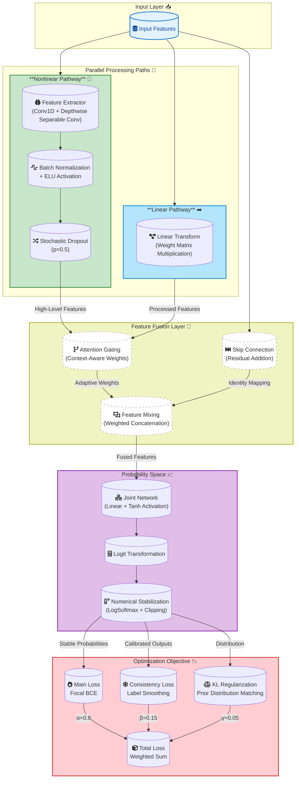

```mermaid
flowchart TB
    subgraph Input["Input Layer 📥"]
        X[("fa:fa-database Input Features")]
    end

    subgraph ParallelProcessing["Parallel Processing Paths 🔄"]
        subgraph LinearPath["**Linear Pathway** ➡️"]
            L1[("fa:fa-project-diagram Linear Transform\n(Weight Matrix Multiplication)")]
        end
        
        subgraph NonlinearPath["**Nonlinear Pathway** 🔀"]
            NL1[("fa:fa-brain Feature Extractor\n(Conv1D + Depthwise Separable Conv)")]
            NL2[("fa:fa-wave-square Batch Normalization\n+ ELU Activation")]
            NL3[("fa:fa-random Stochastic Dropout\n(p=0.5)")]
            
            NL1 --> NL2
            NL2 --> NL3
        end
    end
    
    subgraph Combination["Feature Fusion Layer 🔀"]
        G1[("fa:fa-code-branch Attention Gating\n(Context-Aware Weights)")]
        M1[("fa:fa-object-ungroup Feature Mixing\n(Weighted Concatenation)")]
        SK1[("fa:fa-fast-forward Skip Connection\n(Residual Addition)")]
        
        G1 -->|Adaptive Weights| M1
        SK1 -->|Identity Mapping| M1
    end
    
    subgraph Probability["Probability Space 📈"]
        P1[("fa:fa-network-wired Joint Network\n(Linear + Tanh Activation)")]
        P2[("fa:fa-calculator Logit Transformation")]
        P3[("fa:fa-temperature-low Numerical Stabilization\n(LogSoftmax + Clipping)")]
        
        P1 --> P2
        P2 --> P3
    end
    
    subgraph Loss["Optimization Objective 📉"]
        L2[("fa:fa-fire Main Loss\nFocal BCE")]
        L3[("fa:fa-snowflake Consistency Loss\nLabel Smoothing")]
        L4[("fa:fa-scale-balanced KL Regularization\nPrior Distribution Matching")]
        L5[("fa:fa-cube Total Loss\nWeighted Sum")] 
        
        L2 -->|α=0.8| L5
        L3 -->|β=0.15| L5
        L4 -->|γ=0.05| L5
    end

    X --> LinearPath
    X --> NonlinearPath
    X --> SK1
    
    LinearPath -->|Processed Features| G1
    NL3 -->|High-Level Features| G1
    
    M1 -->|Fused Features| P1
    
    P3 -->|Stable Probabilities| L2
    P3 -->|Calibrated Outputs| L3
    P3 -->|Distribution| L4

    classDef input fill:#e3f2fd,stroke:#1976d2,stroke-width:2px,color:#0d47a1;
    classDef linear fill:#b3e5fc,stroke:#0288d1,stroke-width:2px;
    classDef nonlinear fill:#c8e6c9,stroke:#388e3c,stroke-width:2px;
    classDef fusion fill:#f0f4c3,stroke:#afb42b,stroke-width:2px;
    classDef probability fill:#e1bee7,stroke:#8e24aa,stroke-width:2px;
    classDef loss fill:#ffcdd2,stroke:#d32f2f,stroke-width:2px;
    classDef connector fill:#ffffff,stroke:#9e9e9e,stroke-dasharray:5 5;
    
    class X input;
    class LinearPath linear;
    class NonlinearPath nonlinear;
    class Combination fusion;
    class Probability probability;
    class Loss loss;
    class G1,M1,SK1 connector;
```